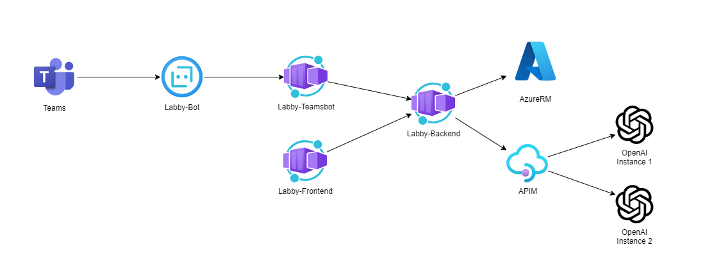

# labby

A sample copilot using Semantic Kernel to interact with the Azure resource manager APIs. This repo also provides a react frontend or a Teams chat bot to interact with the backend API.

## Architecture

## Deploying

See terraform directory